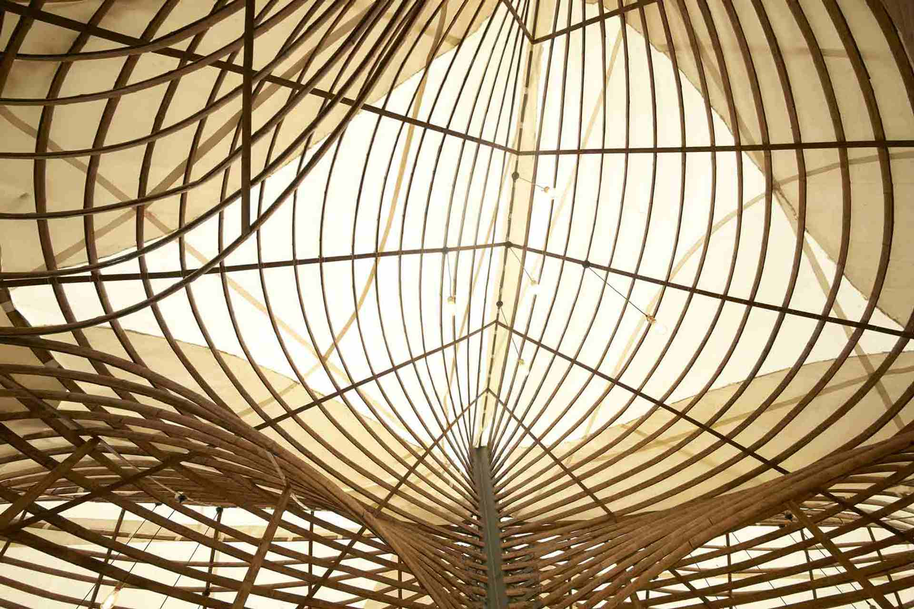
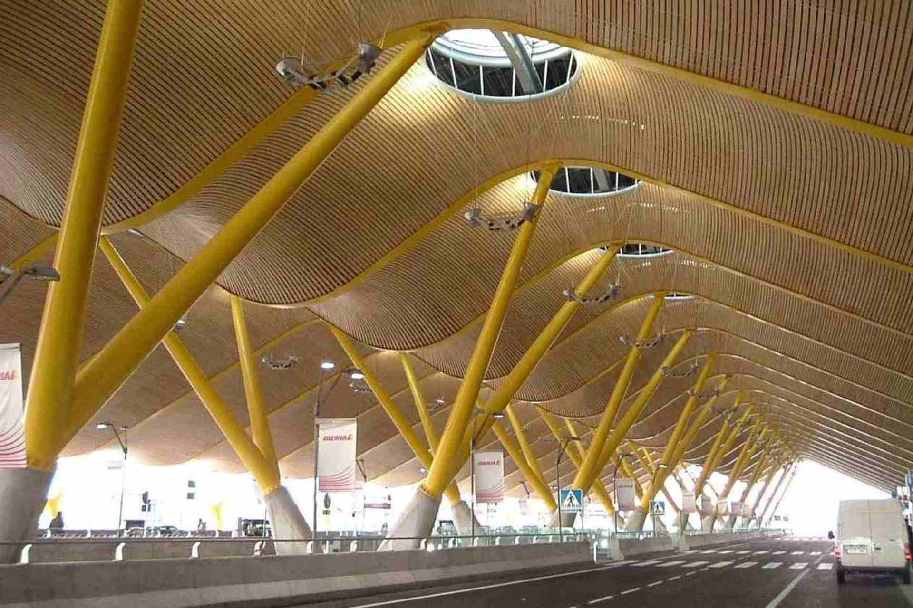
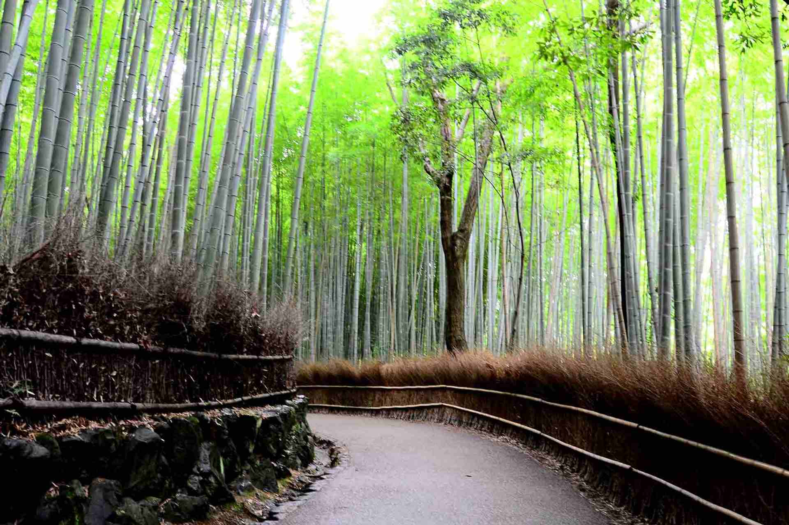

Bamboo, technically a grass, has been used in building for centuries due to its impressive strength. It offer twice the compressive strength of concrete and about the same strength-to-weight ratio of steel in tension. [1]

Bamboo provides excellent carbon sequestration, seventeen times as much carbon as a typical tree forest. [1]

Its leaves are a high-quality forage for livestock and its shoots are delicacy enjoyed by humans. Unlike trees that rarely grow back once cut, bamboo will continue to produce new shoots even after harvesting it.

>"Bamboo is unmatched as a sustainable building material. What it can do is remarkable. It grows far more quickly than timber and doesn't destroy the land it's grown on" _Ben Ripple, Big Tree Farms Bali co-founder_

All over the world buildings utilize bamboo. It is used for skeletons for his strength, for furniture, curtains, accessories or coffee tables made from thin bamboo slats.

Flexibility has helped bamboo being used in flooring, staircase railings, balustrades and slanted windows in houses. Some of the State Bamboo Corporations in India have launched interlocking floor tiles made of flattened bamboo boards, with technology sourced from China.[2]

Recent innovative bamboo flooring resembles smooth timber.

One reason bamboo is so environmentally-friendly is the speed at which it grows. It provides excellent erosion control because of its extensive interlocking rhizomes or root systems, helps in bio-remediation of both soil and water. [1]

Studies show construction is one of the world's least sustainable industries, eating up around half of the globe's non-renewable resources, but sustainable construction is slowly taking root around the world.

>"In China, eucalyptus can grow at three to four meters a year, which is very impressive for timber. But building-quality bamboo will grow between six and 10 meters in that time,"_Terry Sunderland, scientist at the Centre for International Forestry Research in Indonesia_

Bamboo has its drawbacks. Without intensive treatment, it is prone to rotting and catches fire relatively easily, which is why many countries limit bamboo structures height by law.

Bamboo possesses large amounts of starch (sugars) which are the principle nutrients for parasites, borers and fungi. When carbohydrates are reduced, the bamboo culm will be more naturally resistant to those biological degrading organisms. [3]

Starch content is at its highest level at the end of dry season, the plant is acquiring and conserving nutrients for shoot growth in the next rainy season. During rainy season, starch content is lower, since new shoots are consuming all the nutrients, but moisture content in the bamboo culms is high. Recommended time to harvest bamboo is at the end of rainy season - beginning of the dry season. [3]

Studies show remarkable differences with untreated bamboo, when harvested at specific hours and moon. The starch content is lowest when the moon is closer to earth, providing higher gravitation. Note that due to the moon elliptic orbit, gravitation is not related to the moon phase, as popular beliefs suggest. [3]

Bamboo is harvested before sunrise, when most of the starch is still in the roots. To further reduce starch sometimes bamboo is also soaked for 90 days before further treatments.

Only mature bamboo, between 4 and 7 years old, is harvested. Poles inside the clump are older than those growing outside. An experienced bamboo harvester will be able to tell the age of bamboo by knocking on the culm and listening the different sounds. [3]

Building with bamboo is not fool proof, but technologies to protect it from the elements are rapidly improving.

Hight heat is used to cure the bamboo. The bamboo will change color slightly. Resin will rise to the surface, making it stronger. Resin is rubbed into the bamboo culms. The color will slowly change from deep green to mint green. [4]

Holes are then poked in its inner membranes to quicken the drying process. The culms are stored away from direct soil to prevent fungal or insect infestations and away from direct sunlight, as moisture will damage it. [4]

Bamboo is then covered with a tarp and provided decent air ventilation. Vertical stacking lessens the chance of a fungal infection. But sturdier support system is needed to prevent bending. [4]

Horizontal stacking works better for large stacks. A thick, plastic sheet is placed under each stacks prevent fungal infections. Poles are rotated every 15 days. This assures culms will dry in a uniform fashion. Bamboo should be dry in 6 to 12 weeks. [5]

When it loses its glossy appearance its restored by gently oiling and waxing the bamboo once the drying process is finished. [6]

To remove bamboo mold, lemon oil or a solution of vinegar and water can be used. Bamboo furniture usually 3 coats of polyurethane is applied to ensure the conservation of the furniture after treating it with turpentine and dried out completely. [6]

**_Know more:_**

[Building with bamboo -  the basics](https://www.buildingtrustinternational.org/BTIBambooToolkit.pdf)

[Bamboo](https://en.wikipedia.org/wiki/Bamboo)

[bamboo facts, by Ibuku](http://ibuku.com/resources/bamboo-facts/)

**_References:_**

1.
[All praise bamboo](http://www.cultureofpermaculture.org/blog/2014/01/all-praise-bamboo/)

2.
[Bamboo as a top-notch construction material](http://www.asiagreenbuildings.com/9299/bamboo-top-notch-construction-material/)

3.
[When and How to Harvest Bamboo ](https://www.guaduabamboo.com/cultivation/when-and-how-to-harvest-bamboo)

4.
[Cure bamboo](https://www.wikihow.com/Cure-Bamboo)

5.
[Drying bamboo poles](https://www.guaduabamboo.com/preservation/drying-bamboo-poles)

6.
[Remove bamboo mold](https://www.guaduabamboo.com/preservation/how-to-remove-bamboo-mold)
