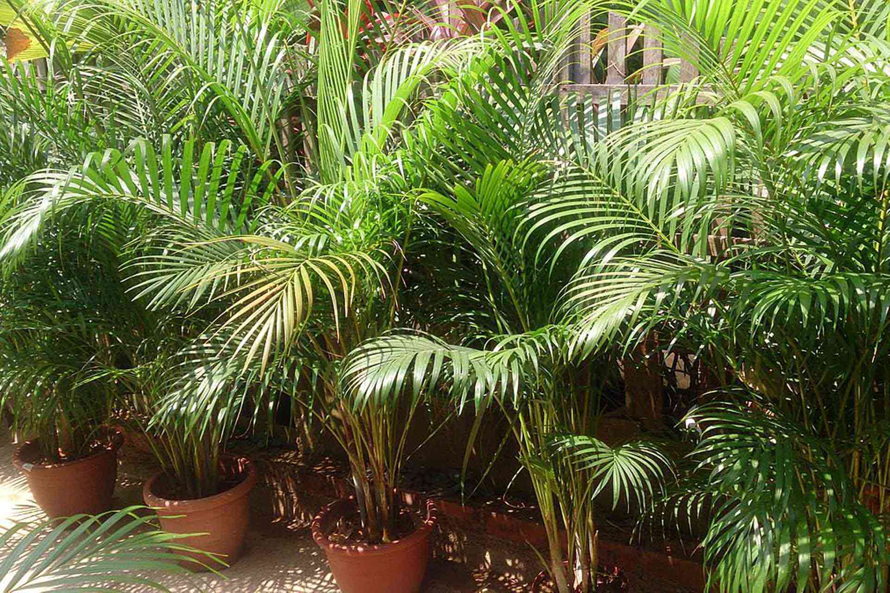
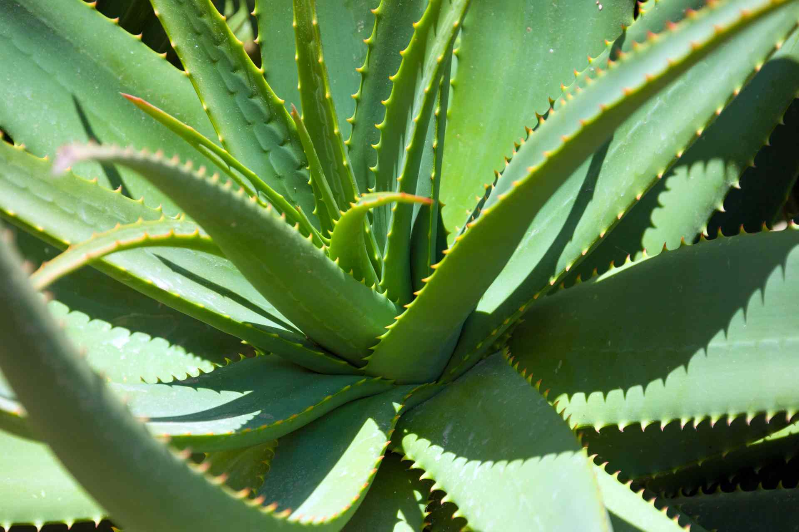
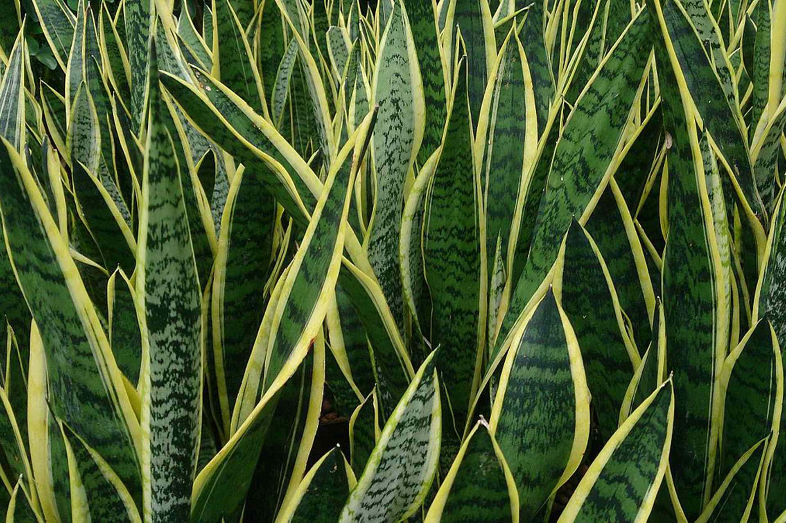
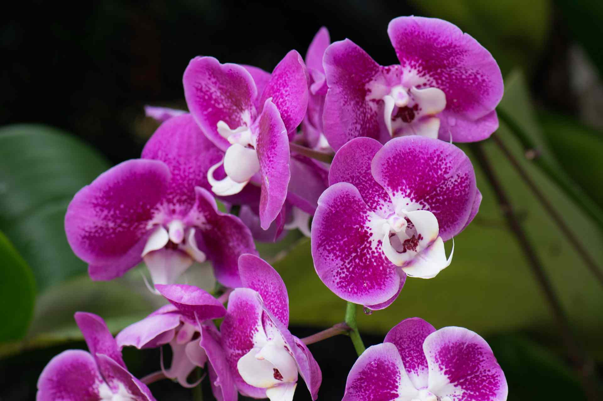
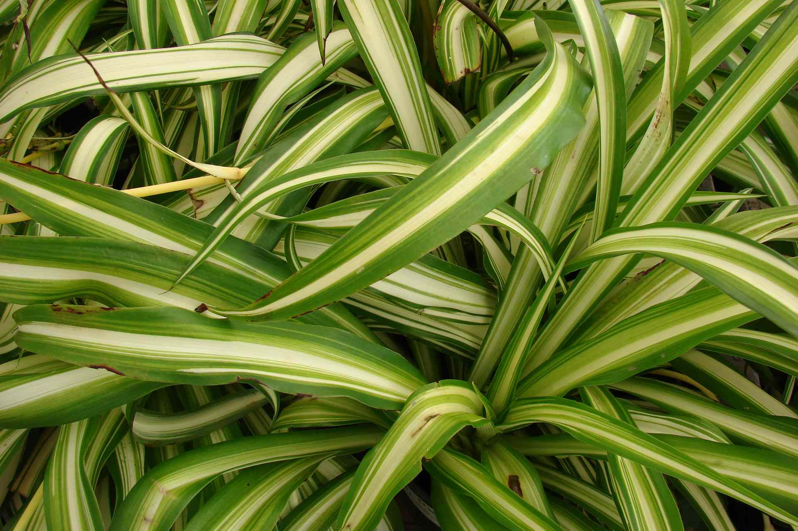
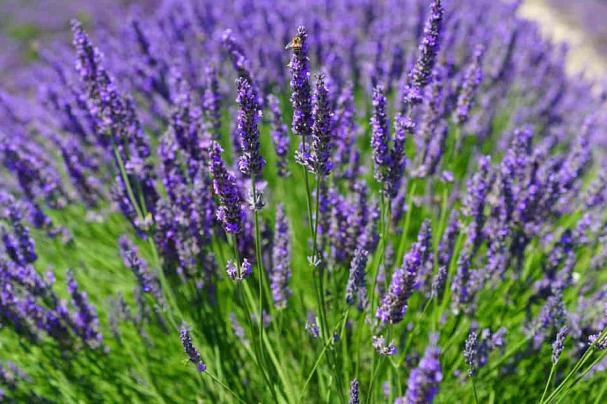
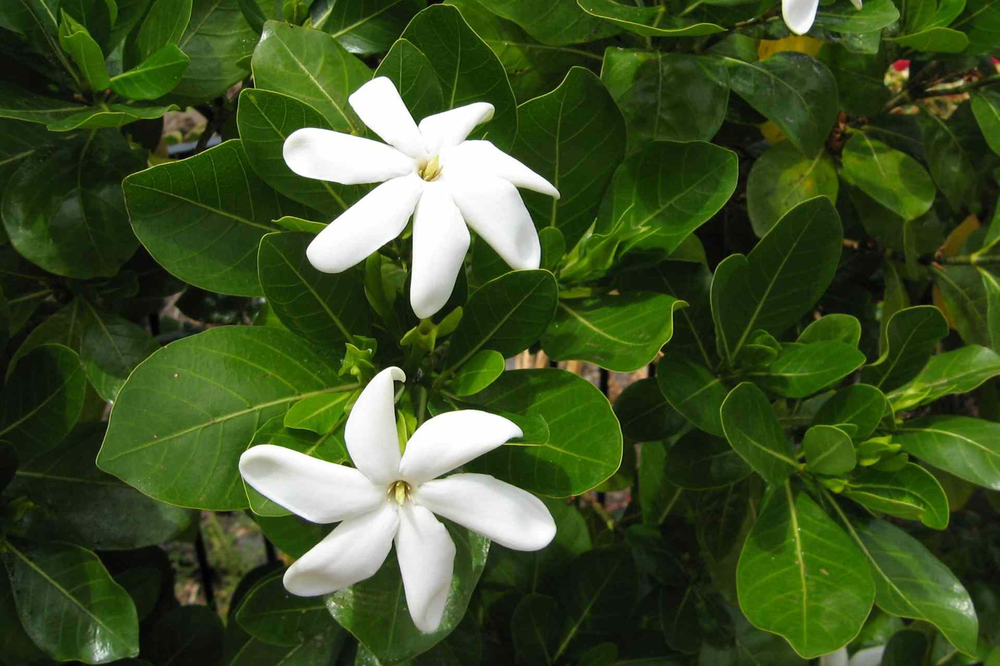
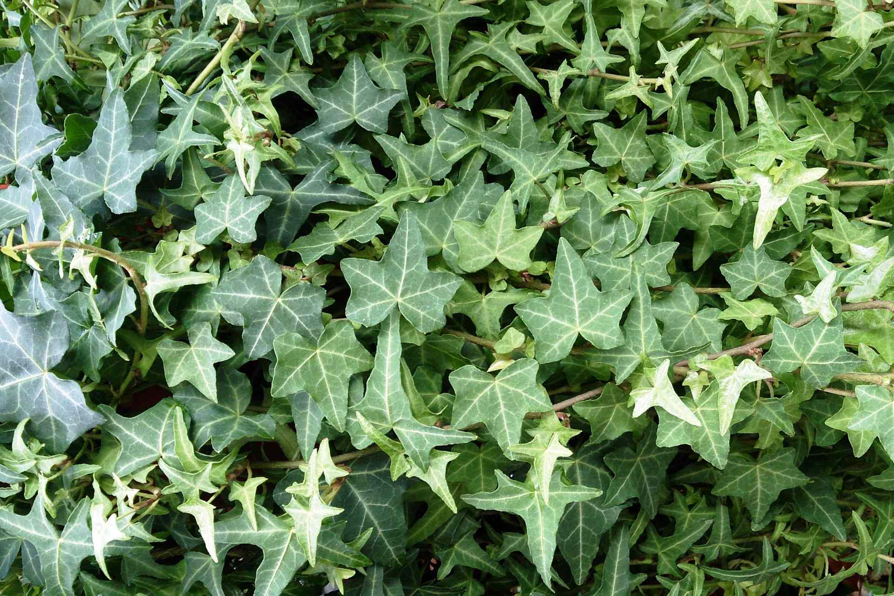
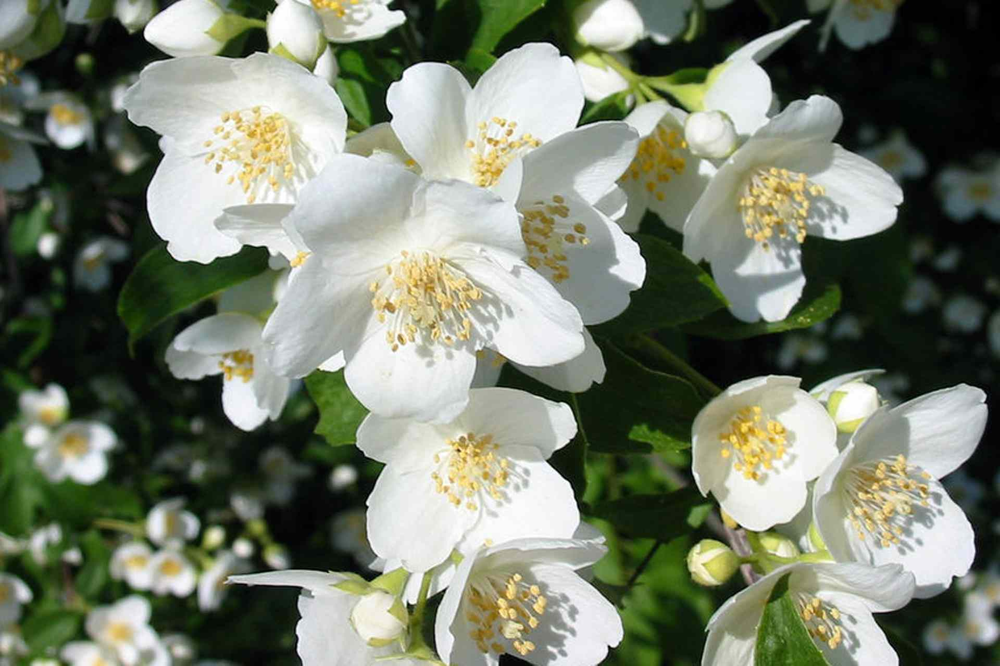
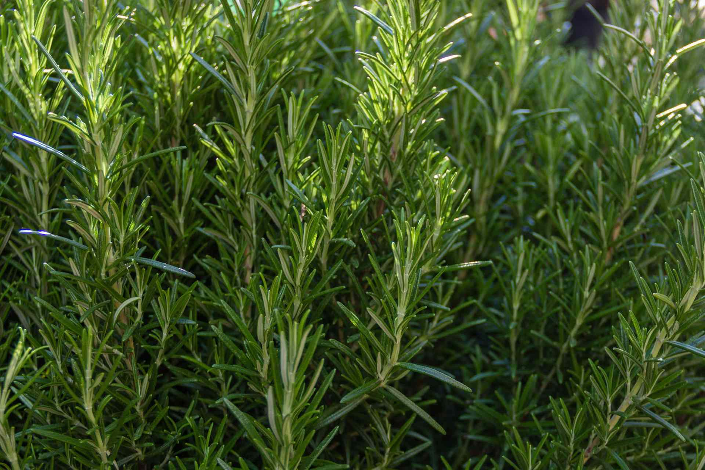

Sure, that potted fern is pretty, but can it really spruce up the air quality in your home? Studies by scientists at NASA, Pennsylvania State University, the University of Georgia and other respected institutions suggest that it can.

Plants are notoriously adept at absorbing gases through pores on the surface of their leaves. It's this skill that facilitates photosynthesis, the process by which plants convert light energy and carbon dioxide into chemical energy to fuel growth.

But scientists studying the air-purification capacities of indoor plants have found that plants can absorb many other gases in addition to carbon dioxide, including a long list of volatile organic compounds (VOCs). Benzene (found in some plastics, fabrics, pesticides and cigarette smoke) and formaldehyde (found in some cosmetics, dish detergent, fabric softener and carpet cleaner)  are examples of common indoor VOCs that plants help eliminate.

These VOCs and other indoor air pollutants (such as ozone) have been linked to numerous acute conditions, including asthma and nausea, as well as chronic diseases such as cancer and respiratory illnesses.

An indoor plant's ability to remove these harmful compounds from the air is an example of [phytoremediation](https://en.wikipedia.org/wiki/Phytoremediation), which is the use of any plant — indoors or out — to mitigate pollution in air, soil or water.

Indoor plants remove pollutants from the air by absorbing these gases through their leaves and roots. The microorganisms that live in the soil of potted plants also play an instrumental role in neutralizing VOCs and other pollutants.

While most leafy plants are adept at purifying indoor air, some of the plants that scientists have found most useful in removing VOCs include Japanese royal ferns, spider plants, Boston ferns, purple waffle plants, English ivy, Areca palms, golden pothos, aloe vera, snake plants and peace lilies.

### Areca palm

In NASA's famous research looking at the air-purifying qualities of houseplants, they found that the areca palm filters certain volatile organic compounds (VOCs) from the air.

Meanwhile, famed plant scientist Dr. B. C. Wolverton notes that a ~6-foot Areca palm can transpire 1 liter of water per 24 hours, thereby making it an effective humidifier, which can help with allergies, colds, or other breathing discomforts that can disrupt sleep.

### Aloe Vera

Easy to keep and aesthetically pleasing in any home, the aloe vera plant has been named as one of the best plants for air purification by [NASA Clean Air Study](https://en.wikipedia.org/wiki/NASA_Clean_Air_Study).

It releases oxygen at the night, making it an ideal bedroom addition. It also fights benzene, which is found in detergents and plastics, and formaldehyde, found in varnishes and floor finishes, so helps improving the air quality.

### Mother-in-law's tongue

Snake plants are actually an amazing addition to your bedroom. The plant can filter harmful toxins from the air you breathe, remove carbon dioxide from the air, and release oxygen all night long, helping you sleep better and wake up feeling energized.

Snake plants are especially recommended for those with allergies and breathing issues such as asthma. Mother-in-law's tongue was shown to be a great air purifier. Researcher [Kamal Meattle gives a TED Talk](https://www.ted.com/talks/kamal_meattle_on_how_to_grow_your_own_fresh_air#t-73315) shout-out to this one too as one of the three plants he uses "to grow fresh air."

### Peepal tree

Despite the negative superstitions, Peepal tree, or Sacred fig, has several benefits which makes it a rather important tree. It not only emits oxygen but can also be used to manage diabetes, treat constipation and asthama.

This sacred tree native to the Indian subcontinent hold a wealth of medicinal value and is used to treat many ailments and diseases, ranging from a snake bite to asthma, skin diseases, kidney diseases, constipation, dysentery, impotency and various blood-related problems, said Acharya Bal Krishan of the Patanjali Ayurveda Ltd. in Haridwar, Uttarakhand.

### Orchids

Beautiful and beneficial, orchids are a perfect choice to be settled in the corner of your bedroom. Apart from emitting oxygen during the nighttime, Orchids also banish xylene – pollutant found in paints, and fills the room with fresh air to breathe.

When photosynthesis stops most plants switch things up and begin absorbing oxygen and releasing carbon dioxide. However, orchids, succulents and bromeliads go rebellious and take in carbon dioxide and release oxygen during the p.m. hours, making them great plants to keep the air fresh at night.

### Spider Plant

Not to be confused with the Snake Plant, the Spider Plant is also a champion cleanser of air. [Chlorophytum comosum](https://en.wikipedia.org/wiki/Chlorophytum_comosum), often called spider plant but also known as airplane plant, St. Bernard's lily, spider ivy, ribbon plant, and hen and chickens is a species of perennial flowering plant. The NASA tests showed it to remove around 90% of the potentially cancer-causing chemical formaldehyde from the air.

Since formaldehyde is found in common household products like adhesives, grout and fillers, it’s a good idea to keep one of these plants around. Spider Plants will also absorb odors and fumes as well as sustaining oxygen levels in the room, promoting better sleep.

### Lavender

Who doesn’t love the scent of lavender? It’s also probably the most well-known of all plants when it comes to inducing sleep and [reducing anxiety levels](https://www.ncbi.nlm.nih.gov/pmc/articles/PMC3612440/).

Research backs up these claims, with lavender scents shown to slow down heart rate, lower blood pressure and levels of stress.

Read more on the [benefits of lavender oil here!](https://bettermindbodysoul.com/benefits-of-lavender-oil/)

### Gardenia

With glossy evergreen leaves and beautifully scented blossoms, Gardenias are a popular plant choice for bedrooms.

Studies [indicate](https://www.ncbi.nlm.nih.gov/pubmed/20537515) that keeping one in your room may help you achieve a better quality of sleep, with claims that it may be [as effective as Valium](http://aktuell.ruhr-uni-bochum.de/pm2010/pm00222.html.en) in relieving anxiety and promoting sleep.

### English Ivy

Hedera helix, the common ivy, English ivy, European ivy, or just ivy, is a species of flowering plant in the family Araliaceae, native to most of Europe and western Asia. Another one of NASA’s top plants for purifying the air. Studies have shown that English Ivy leaf can improve symptoms of allergies or asthma. The American College of Allergy, Asthma & Immunology reported that, in a 2005 experiment, English Ivy removed 94% of airborne feces and 78% of airborne mold in just 12 hours!

As mold can affect our breathing, it’s definitely a plant to have on hand for a great night’s sleep.

### Jasmine

Jasmine plants, with its sweet fragrance and gorgeous white flowers, make for an excellent addition to any bedroom.

It's highly recommended for help with depression, stress, fatigue, and anxiety. Jasmine can lift your mood, calm you down, alleviate stress, and gently lull you to sleep. Studies have shown that subjects who inhaled the scent of jasmine while sleeping experienced deeper sleep, less movement throughout the night, and overall better quality of sleep.

### Rosemary

A commonly used herb for cooking purposes, rosemary can also help you get better sleep. Rosemary has been considered a memory booster for centuries in ancient medicine.

Practitioners today recommend rosemary essential oil for supporting the nervous system and circulatory health, improving concentration, and relieving stress.

## Know More Links

[NASA Clean Air Study](https://en.wikipedia.org/wiki/NASA_Clean_Air_Study)

[(Excellent guide) Air Cleaning Plants - ohsospotless](https://ohsospotless.com/air-cleaning-plants/)

[Plants to help you sleep](http://www.naturallivingideas.com/12-plants-for-your-bedroom-to-help-you-sleep/)

[Indoor plants which clean the air](https://www.livescience.com/38445-indoor-plants-clean-air.html)

[Crassulacean acid metabolism, CAM photosynthesis](https://en.wikipedia.org/wiki/Crassulacean_acid_metabolism)

[Houseplants that clean air](https://greatist.com/connect/houseplants-that-clean-air)

[Benefits of lavender oil](https://bettermindbodysoul.com/benefits-of-lavender-oil/)
